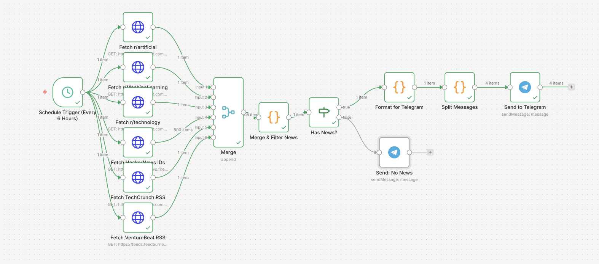
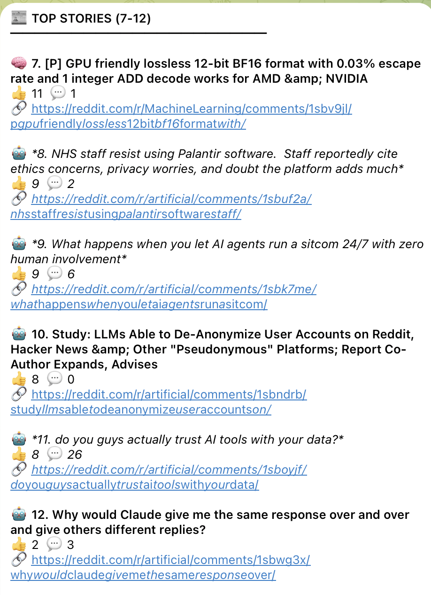

# AI & Tech News → Telegram (n8n)

An `n8n` workflow that collects AI and technology stories every 6 hours and sends a curated digest to Telegram.

 

## What this workflow does

- Triggers automatically every 6 hours
- Fetches stories from:
  - Reddit: `r/artificial`, `r/MachineLearning`, `r/technology`
  - Hacker News
  - TechCrunch RSS
  - VentureBeat RSS
- Merges and filters posts using AI/tech keywords
- Removes duplicates and ranks top stories
- Formats digest messages for Telegram (split into multiple messages)
- Sends a fallback message if no relevant stories are found

## Repository contents

- `AI & Tech News → Telegram (No AI).json` — importable n8n workflow
- `README.md` — project documentation

## Requirements

- n8n instance (self-hosted or cloud)
- Telegram Bot Token (via BotFather)
- Telegram chat ID where digest messages should be sent

## Setup

1. Open n8n.
2. Import the workflow JSON file.
3. Configure Telegram credentials in the **Send to Telegram** and **Send: No News** nodes.
4. Update chat ID values in Telegram nodes if needed.
5. (Optional) Adjust schedule interval in **Schedule Trigger (Every 6 Hours)**.
6. Activate the workflow.

## Customization ideas

- Change keyword list in **Merge & Filter News**.
- Add/remove data sources.
- Tune number of stories sent.
- Modify message format/Markdown in **Format for Telegram**.

## Notes

- The workflow is currently inactive by default (`"active": false`).
- Review imported node settings before activating in production.
- Keep bot credentials private and avoid committing secrets.
